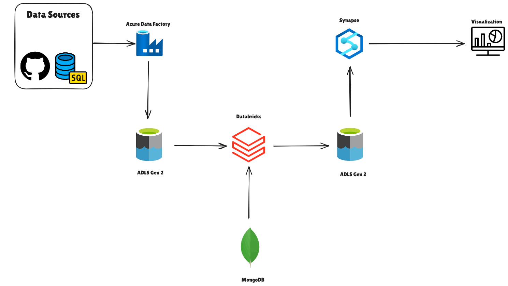

# Big Data Analytics on Azure Cloud 

The Project Demonstrates a scalable Big Data Analytics pipeline built and deployed on Microsoft Azure. It Involves data ingestion , processing , transformation and visualization using Azure Services such as Azure Data Factory , ADLS Gen 2 , Azure Databricks , Synapse , PowerBI, Tableu and Fabric. 

## Objectives

- Analyze large datasets efficiently using distributed computing.
- Build a data pipeline that automates ingestion, transformation, and visualization.
- Deploy the solution using Azure cloud services for scalability and reliablity.
- Bring this project as close as possible to a real-world implementation to gain hands-on experience with Azure's data ecosystem and cloud deployment best practices.


## Architecture

1. Data Sources - Github , SQL database , MongoDB , Azure Data Factory
2. Data Processing - Azure Databricks (PySpark)
3. Data Warehouse - Azure Synapse Analytics
4. Data Visualization - Power BI , Tableu and Fabric



## Tech Stack

- **Cloud Platform:** Microsoft Azure  
- **Data Storage:** Azure Data Lake Storage Gen2  
- **Data Processing:** Azure Databricks, Apache Spark, PySpark  
- **Data Warehousing:** Azure Synapse Analytics  
- **Visualization:** Power BI , Tableu , Fabric
- **Version Control:** GitHub  
- **Languages:** Python, SQL

## 📊 Dataset

- **Source:** [Olist E-Commerce Dataset](https://www.kaggle.com/datasets/olistbr/brazilian-ecommerce) – a public dataset from Kaggle containing detailed information about Brazilian e-commerce orders.  
- **Size:** Approximately 1.2 GB of structured and semi-structured data.  
- **Format:** Multiple CSV files covering orders, customers, payments, products, and reviews.  
- **Key Features:** Order dates, product categories, payment values, delivery performance, customer demographics, and review scores.  
- **Realistic Simulation:** To mimic a real-world data environment, the dataset was intentionally distributed across multiple sources — **GitHub**, **SQL Database**, and **MongoDB** — representing data ingestion from diverse systems before unification in the Azure data pipeline.


## Deployment Steps / How to Run

1. clone the repository 
```bash
    https://github.com/GojoV339/Design-and-Deployment-of-Big-Data-Analytics-Pipeline-on-Azure
```
2. Upload the data to Azure Data Lake Storage.

3. Configure Databricks workspace and run the provided notebooks 

4. Load processed data into Azure Synapse Analytics.

5. Connect Power BI to Synapse for reporting.


